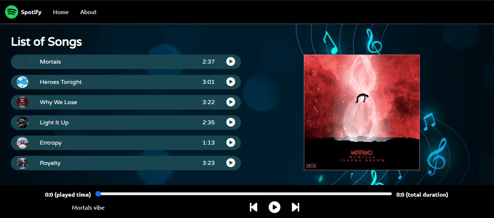

# 🎵 Basic Music Player

A simple, elegant music player built using HTML, CSS, and JavaScript. This project showcases how to create a functional web-based audio player with features like play, pause, next, previous, and dynamic song information display.

## 🚀 Features

- Play and pause music
- Skip to next or previous track
- Display of song name, artist, and artwork
- Seek bar and duration tracking
- Responsive design

## 📸 Preview

  

## 🛠️ Built With

- HTML
- CSS
- JavaScript (Vanilla JS)

## 📁 Project Structure

```
basic-music-player/
├── assets/
│   ├── images/       # Album art / icons
│   └── music/        # MP3 files
├── index.html
├── style.css
└── script.js
```

## 🧑‍💻 Getting Started

To run the music player locally:

1. Clone the repository:
   ```bash
   git clone https://github.com/abdulsattar0617/basic-music-player.git
   ```
2. Navigate to the project folder:
   ```bash
   cd basic-music-player
   ```
3. Open `index.html` in your browser.

> No installation or server required. Just open and play!

## 📌 How It Works

- The `script.js` file manages audio playback logic and DOM manipulation.
- Songs are stored in the `/assets/music` folder and dynamically loaded into the player.
- The seek bar and duration are updated in real-time using JavaScript.

## 🧠 Learnings

This project helped me strengthen my skills in:
- DOM manipulation
- Event handling
- Audio API in JavaScript
- UI/UX design with CSS

## 🤝 Contributing

Feel free to fork the project, suggest improvements, or report bugs via issues or pull requests!

## 📄 License

This project is open source and available under the [MIT License](LICENSE).

## 🙌 Acknowledgements

- Thanks to open-source contributors and designers who inspire simple yet functional UI ideas.
- Icons and images are either custom-made or from free resources.

---

Happy Listening! 🎧
